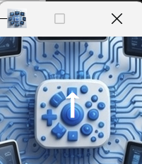

# Oriented

A lightweight Windows utility for controlling screen orientation, designed for tablets and convertible devices.



## Features

- **Double-tap to rotate** - Double-click or double-tap the window to rotate the screen 90°
- **Drag to move** - Click and drag anywhere on the window to reposition it
- **Global hotkeys** - Ctrl+Alt+Arrow keys for instant rotation (NVIDIA/Intel style)
- **System tray integration** - Runs in system tray for unobtrusive operation
- **Lock/unlock rotation** - Click the tray icon to toggle between locked and auto-rotate modes
- **Sensor support** - Automatically rotates based on device orientation when unlocked
- **Single file** - ~500KB native Windows executable with all resources embedded

## Usage

### Command Line

```
Oriented.exe [-m]
```

- `-m` or `/m` or `-minimized` - Start minimized to system tray

### Main Window
- **Click + drag**: Move the window
- **Double-click/tap**: Rotate screen 90° clockwise
- **Right-click**: Context menu
- **Minimize / Close (X)**: Minimize to system tray

### System Tray
- **Left-click**: Toggle between locked/unlocked rotation
  - Green icon: Auto-rotation enabled (unlocked)
  - Orange icon: Rotation locked
- **Right-click menu**:
  - **Show**: Restore main window
  - **Toggle 90°**: Rotate screen 90° clockwise
  - **Auto**: Orient to current sensor reading
  - **Exit**: Close application

### Global Hotkeys

NVIDIA/Intel-style keyboard shortcuts work system-wide:

| Hotkey | Action |
|--------|--------|
| Ctrl+Alt+Up | Normal (0°) |
| Ctrl+Alt+Down | Upside down (180°) |
| Ctrl+Alt+Left | Portrait (90° CCW) |
| Ctrl+Alt+Right | Portrait (90° CW) |

## Building

Requires Visual Studio 2022 with C++ workload and Windows SDK.

```powershell
# Convert icons (only needed if modifying source images)
.\convert-icon.ps1

# Build
.\build.ps1
```

## Deployment

Just copy `Oriented.exe` to the target device. All resources (icons, background image, manifest) are embedded in the executable.

## Requirements

- Windows 10 or later
- Device with orientation sensor (optional - manual rotation still works)

## License

MIT License - see [LICENSE](LICENSE)
