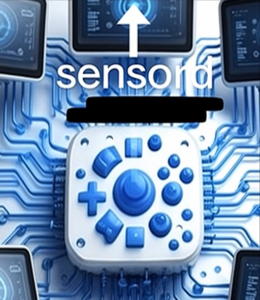

# sensord

Windows sensor utilities.

## Projects

| Project                                           | Description                                                                                                                                                                                                                                                                                                                                                                                                     |
| ------------------------------------------------- | --------------------------------------------------------------------------------------------------------------------------------------------------------------------------------------------------------------------------------------------------------------------------------------------------------------------------------------------------------------------------------------------------------------- |
| [ScreenCompass](ScreenCompass/) | Halrad Sensord ScreenCompass provides reliable screen‑rotation control on any device, with or without a hardware sensor.   It’s built for tablets and convertibles, offering smooth auto‑rotation when sensors are available and precise manual rotation when they’re not. ScreenCompass supports touch, mouse, and keyboard input, giving you flexible, predictable orientation control in every workflow. |

## License

MIT License - see [LICENSE](LICENSE)
