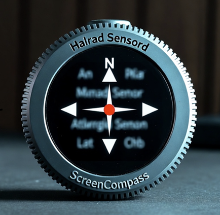

# ScreenCompass - Always the right angle.

A lightweight Windows utility for managing screen orientation, built for tablets and convertible devices.



## Features

* **Double‑tap to rotate** — Double‑click or double‑tap the window to rotate the display 90°.

* **Drag to move** — Click and drag anywhere on the window to reposition it.

* **Global hotkeys** — Use Ctrl + Alt + Arrow keys for instant rotation (NVIDIA/Intel style).

* **System tray integration** — Runs quietly in the tray for unobtrusive operation.

* **Lock / unlock rotation** — Click the tray icon to toggle between locked and auto‑rotate modes.

* **Sensor support** — Automatically rotates based on device orientation when unlocked.

* **Single‑file executable** — ~500 KB native Windows binary with all resources embedded.

## Usage

### Command Line

```
ScreenCompass.exe [-m]
```

- `-m` or `/m` or `-minimized` - Start minimized to system tray

### ### Main Window

* **Click + drag** — Move the window.

* **Double‑click / tap** — Rotate the screen 90° clockwise.

* **Right‑click** — Open the context menu.

* **Minimize / Close (X)** — Minimize to the system tray.

### System Tray

* **Left‑click** — Toggle rotation lock.
  
  * **Green icon** — Auto‑rotation enabled (unlocked).
  
  * **Orange icon** — Rotation locked.

* **Right‑click menu**:
  
  * **Show** — Restore the main window.
  
  * **Toggle 90°** — Rotate the screen 90° clockwise.
  
  * **Auto** — Orient to the current sensor reading.
  
  * **Exit** — Close the application.

### Global Hotkeys

NVIDIA/Intel‑style shortcuts work system‑wide:

| Hotkey         | Action             |
| -------------- | ------------------ |
| Ctrl+Alt+Up    | Normal (0°)        |
| Ctrl+Alt+Down  | Upside‑down (180°) |
| Ctrl+Alt+Left  | Portrait (90° CCW) |
| Ctrl+Alt+Right | Portrait (90° CW)  |

Building
--------

Requires **Visual Studio 2022** with the C++ workload and Windows SDK.

```powershell
# Convert icons (only needed if modifying source images)
.\convert-icon.ps1

# Build
.\build.ps1
```

## Deployment

Copy `ScreenCompass.exe` to the target device.All resources (icons, background image, manifest) are embedded in the executable.
Requirements

------------

* Windows 10 or later

* Orientation sensor (optional — manual rotation works without one)

## License

MIT License - see [LICENSE](LICENSE)
